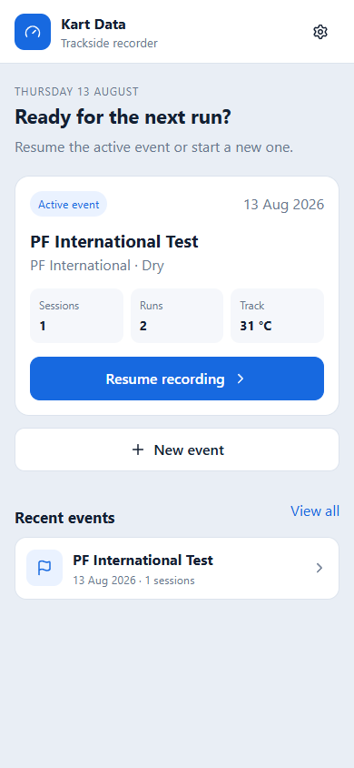
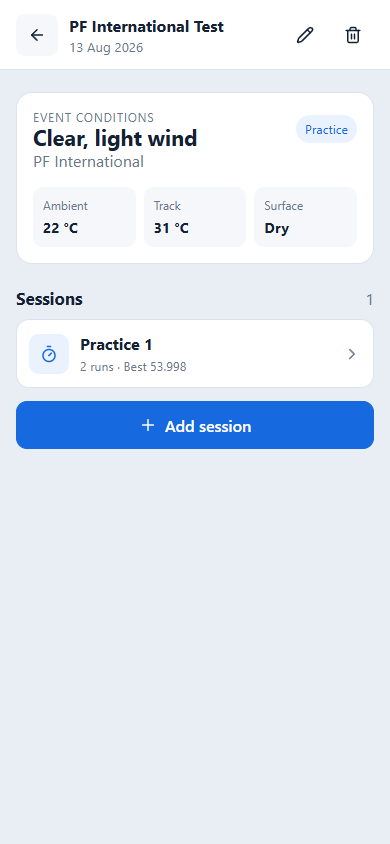
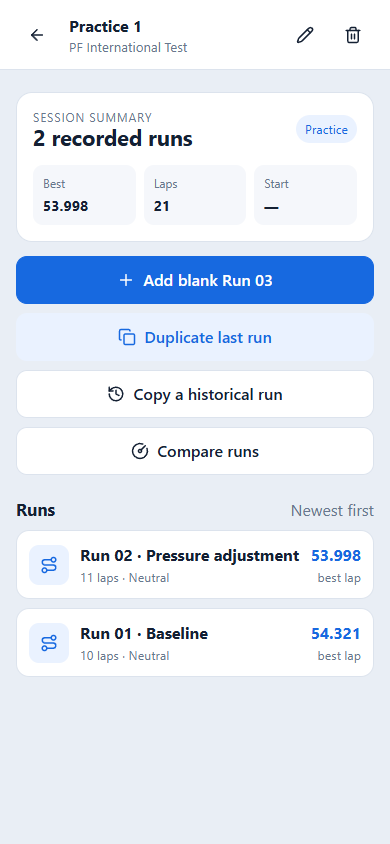
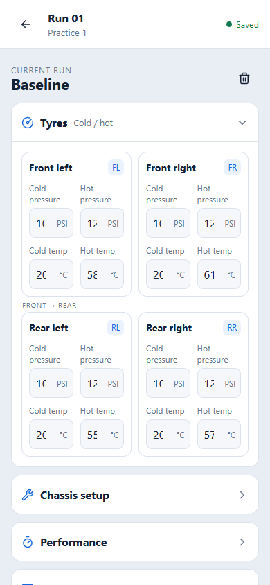
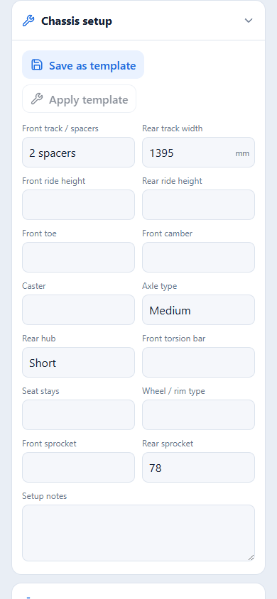
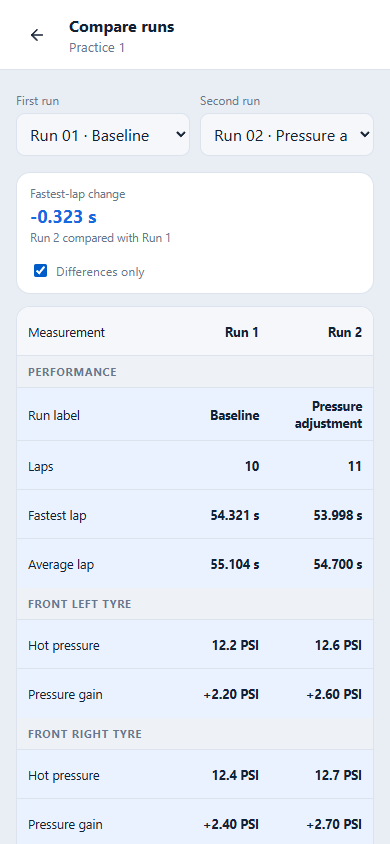
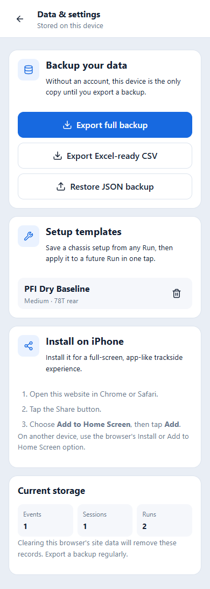

# Kart Data 用户操作手册

**适用版本：** v1.8
**更新日期：** 2026-08-17

Kart Data 是一款用于竞赛卡丁车练习和比赛现场的数据记录工具。它可以记录胎压、胎温、车架 Setup、圈速和车手反馈，不需要注册账号。

## 立即打开网站

**[点击这里打开 Kart Data 正式网站 →](https://karting-data-recording-website.vercel.app)**

正式网址：<https://karting-data-recording-website.vercel.app>

> [!IMPORTANT]
> 记录默认只保存在当前设备和当前浏览器中。更换手机或浏览器、清除网站数据或使用无痕模式，都可能导致原有记录不可用。请定期使用 **导出完整备份** 导出 JSON 备份。

> [!NOTE]
> 本手册中的按钮名称使用中文界面。网站同时提供英文界面，两者内容完全一致；切换方法见 [2.1 切换语言](#21-切换语言)。手册中的截图是在英文界面下拍摄的，界面布局与中文界面相同，只有文字不同。

## 目录

1. [认识数据结构](#1-认识数据结构)
2. [快速开始](#2-快速开始)
3. [创建和管理 Event](#3-创建和管理-event)
4. [创建和管理 Session](#4-创建和管理-session)
5. [创建 Run](#5-创建-run)
6. [填写 Run 数据](#6-填写-run-数据)
7. [使用 Setup 模板](#7-使用-setup-模板)
8. [比较两个 Runs](#8-比较两个-runs)
9. [导出、备份和恢复](#9-导出备份和恢复)
10. [安装到 iPhone 主屏幕](#10-安装到-iphone-主屏幕)
11. [编辑和删除记录](#11-编辑和删除记录)
12. [常见问题](#12-常见问题)
13. [使用 Track Map Notebook](#13-使用-track-map-notebook)

## 1. 认识数据结构

所有记录按照以下层级组织：

```text
Event
└── Session
    └── Run
```

- **Event**：一次比赛周末、测试日或练习日，例如 `PF International Test`。
- **Session**：Event 中的一个具体阶段，例如 `Practice 1`、`Qualifying` 或 `Final`。
- **Run**：一次实际出场。胎压、胎温、Setup、圈速和驾驶反馈都记录在 Run 中。

Event、Session、Run、Setup、Marker、Track、Layout 这些结构名称在中文界面中保持英文，与本手册一致。

## 2. 快速开始

第一次使用时，按照以下顺序操作：

1. 点击 **新建 Event**，建立当天的 Event。
2. 点击 **新增 Session**，建立 `Practice 1` 或其他 Session。
3. 点击 **新增空白 Run 01**，建立第一次出场记录。
4. 出场前填写冷态胎压、冷态胎温和 Chassis setup。
5. 回场后填写热态胎压、热态胎温、圈速和 Driver feedback。
6. 点击 **完成 Run 01** 完成记录。
7. 下一次出场前，可以使用 **复制上一个 Run** 复制上一次数据，只修改发生变化的部分。

所有输入都会自动保存。Run 页面右上角显示绿色 **已保存** 时，表示最新修改已写入当前设备。



首页中的主要入口：

- **继续记录**：回到当前 Event。
- **新建 Event**：建立新的 Event。
- **最近的 Events**：打开最近使用过的 Event。
- 右上角齿轮：进入 **数据与设置**。

### 2.1 切换语言

每个页面顶部都有一个显示 **中** 或 **EN** 的按钮，按钮上显示的是点击后会切换到的语言：

- 显示 **中**：当前是英文界面，点击后切换到中文。
- 显示 **EN**：当前是中文界面，点击后切换到英文。

选择会记录在当前浏览器中，下次打开时保持不变。日期格式也会跟随所选语言。

切换语言只改变界面文字，不会改变已保存的数据。Event 类型、赛道状况、Marker 类型等选项在数据库中始终以英文保存，因此无论使用哪种语言，导出的 CSV 和 JSON 备份内容完全相同。

### 切换浅色和深色模式

每个页面顶部都有太阳或月亮图标。点击图标可以在浅色与深色背景之间切换。第一次打开网站时会跟随 iPhone 的系统外观；手动切换后，网站会在当前浏览器中记住你的选择。

## 3. 创建和管理 Event

点击首页的 **新建 Event**，可以填写：

- Event 名称。
- 赛道名称。
- 开始日期 / 结束日期。
- Event 类型：练习、测试、比赛或其他。
- 赛道状况：干地、微湿、湿地或混合。
- 天气：天气描述。
- 环境温度。
- 赛道温度。
- 备注。

建立后，Event 页面会显示环境信息以及其下的所有 Sessions。

### 自动获取环境温度

在新建或编辑 Event 时，点击 **获取当前温度**：

1. 首次使用时允许浏览器访问当前位置。
2. 网站会读取当前位置附近的当前气温，并自动填入 **环境温度**。
3. 检查数值后保存 Event；必要时仍可手动修改。

天气数据来自 Open-Meteo，是当前位置附近的天气模型数据，不等同于围场温度计或赛道表面温度。网络不可用、定位关闭或拒绝定位权限时，仍可继续手动填写。



Event 页面右上角：

- 铅笔图标：编辑 Event 名称和条件等信息。
- 垃圾桶图标：删除 Event。

## 4. 创建和管理 Session

在 Event 页面点击 **新增 Session**，然后填写：

- Session 名称：例如 `Practice 1`、`Heat 2` 或 `Final`。
- 类型：练习、排位、预赛、准决赛、决赛或其他。
- 开始时间。
- 备注。

打开 Session 后，右上角铅笔图标可以修改名称、类型、时间和备注。修改 Session 不会删除或重置其中已有的 Runs。



## 5. 创建 Run

Session 页面提供三种创建方式：

### 新增空白 Run

建立一个完全空白的 Run。适合第一次出场，或者 Setup 与之前完全不同的情况。

### 复制上一个 Run

复制当前 Session 中最后一个 Run 的：

- 四条轮胎的冷热胎压和胎温。
- 全部 Chassis setup。

新 Run 的圈速、圈数、完成状态和 Driver feedback 会保持空白，避免把上一次的比赛结果误认为本次结果。

### 复制历史 Run

从任意 Event 和 Session 中选择一个旧 Run 作为来源。适合重新使用某条赛道或某种天气下的历史 Setup。

## 6. 填写 Run 数据

Run 页面分成四个区域。点击区域标题可以展开或收起。

### 轮胎

四条轮胎按照实际位置排列：

```text
左前 (FL)     右前 (FR)
左后 (RL)     右后 (RR)
```

每条轮胎可以填写：

- 冷态胎压，单位 PSI。
- 热态胎压，单位 PSI。
- 冷态胎温，单位 °C。
- 热态胎温，单位 °C。



### Chassis setup

这里记录前后轮距、车高、前束、前轮外倾角、主销后倾角、后轴类型、后轮毂、前扭力杆、座椅支撑、轮圈和齿盘等设置。



### 成绩

- Run 名称：可选名称，例如 `Baseline` 或 `Pressure adjustment`。
- 圈数。
- 最快圈。
- 平均圈速。
- 名次。

### Driver feedback

- 平衡：转向不足、中性或转向过度。
- 抓地力：低、中或高。
- 刹车：差、可接受或好。
- 入弯、弯中、出弯 / 牵引力：不同弯道阶段的反馈。
- 其他意见。

填写完成后点击页面底部的 **完成 Run**。已完成的 Run 仍然可以重新打开和修改。

## 7. 使用 Setup 模板

Setup 模板用于重复使用一套 Chassis setup。

### 保存模板

1. 打开一个已经填写 Setup 的 Run。
2. 展开 **Chassis setup**。
3. 点击 **另存为模板**。
4. 输入模板名称，例如 `PFI Dry Baseline`。
5. 点击 **保存模板**。

### 应用模板

1. 打开需要填写 Setup 的 Run。
2. 展开 **Chassis setup**。
3. 点击 **应用模板**。
4. 选择模板并确认。

应用模板会替换当前 Run 中所有 Chassis setup 字段，但不会修改轮胎、圈速和 Driver feedback。

在 **数据与设置** 中可以查看和删除已经保存的模板。

## 8. 比较两个 Runs

当一个 Session 至少有两个 Runs 时，点击 **比较 Runs**。

1. 在 **第一个 Run** 和 **第二个 Run** 中选择需要比较的 Runs。
2. 页面会按照成绩、每条轮胎、Chassis setup 和 Driver feedback 分组显示数据。
3. 蓝色背景表示两次 Run 的数据不同。
4. 勾选 **只看差异**，只显示发生变化的项目。
5. **最快圈变化** 显示第二个 Run 相对第一个 Run 的最快圈差值；负数代表第二个 Run 更快。



## 9. 导出、备份和恢复

点击首页右上角齿轮，进入 **数据与设置**。



### 导出完整备份

导出完整 JSON 备份，包括所有 Events、Sessions、Runs、Setup 模板，以及 Track Library 中的 Tracks、Layouts、Markers、Session 观察和地图图片。

JSON 是可以恢复回网站的备份格式。建议在每个赛道日结束后导出一次，并保存到 iCloud Drive、OneDrive 或其他安全位置。

### 导出 Excel 可用的 CSV

导出适合在 Excel 中查看和分析的 CSV 文件，包含三张表：

- Events、Sessions 和 Runs：圈速、反馈、四条轮胎的冷热胎压和胎温及自动计算的增量、全部 Chassis setup 字段。
- 赛道永久 Marker：每个 Layout 的 Marker 及其笔记。
- Session 赛道观察：每次 Session 在各 Marker 上记录的实际观察。

CSV 用于分析和查看，不能用于恢复网站数据。需要恢复时必须使用 JSON 备份。

### 恢复 JSON 备份

1. 点击 **恢复 JSON 备份**。
2. 选择之前导出的 `.json` 文件。
3. 检查确认窗口中显示的 Events、Sessions、Runs、Tracks、Layouts、Markers 和地图图片数量。
4. 点击 **恢复备份**。

> [!WARNING]
> 恢复备份会替换当前浏览器中已有的全部 Kart Data 记录。恢复前建议先导出一份当前备份。

## 10. 安装到 iPhone 主屏幕

1. 在 iPhone 的 Chrome 或 Safari 中打开网站。
2. 点击浏览器的分享按钮。
3. 选择 **添加到主屏幕**。
4. 点击 **添加**。

安装后，Kart Data 会像普通 App 一样从主屏幕全屏打开。网站成功加载或安装后，核心页面也可以在赛道网络不稳定时继续使用。

如果 Chrome 的分享菜单中没有 **添加到主屏幕**，可以改用 Safari 打开同一个网址后再操作。

## 11. 编辑和删除记录

### 编辑

- Event 页面右上角铅笔：编辑 Event。
- Session 页面右上角铅笔：编辑 Session。
- Run：直接打开并修改，系统会自动保存。

### 删除

- 删除 Event 会同时删除其中所有 Sessions 和 Runs。
- 删除 Session 会同时删除其中所有 Runs。
- 删除 Run 只删除当前 Run。
- 删除 Setup 模板不会影响已经使用该模板建立的 Runs。

系统会在删除前显示确认窗口，并说明会一并删除哪些内容。删除完成后目前无法撤销，因此请谨慎操作。

## 12. 常见问题

### 为什么换了一台手机后没有数据？

网站目前没有账号和云同步。数据只属于创建它的设备和浏览器。请在旧设备导出 JSON，再在新设备使用 **恢复 JSON 备份**。

### Chrome 和 Safari 中的数据互通吗？

不会自动互通。即使在同一台 iPhone 上，不同浏览器也有各自的网站存储。要转移数据，需要导出和恢复 JSON。

### 删除 App 图标会删除数据吗？

通常移除主屏幕图标不等于清除网站数据，但不要把它当作备份。重新安装、清理浏览器或系统存储操作仍可能影响数据。

### 可以使用无痕模式吗？

不建议。无痕模式中的网站数据可能在关闭会话后被删除。

### CSV 和 JSON 应该选哪一个？

- 想在 Excel 中分析：使用 CSV。
- 想备份并在以后恢复：使用 JSON。
- 最稳妥的做法：两种都导出。

### 切换语言会影响已有数据吗？

不会。切换语言只改变界面文字。Event 类型、赛道状况和 Marker 类型在数据库中始终以英文保存，导出的 CSV 和 JSON 在两种语言下完全一致。

### 如何确认数据已经保存？

在 Run 页面查看右上角状态。绿色 **已保存** 表示当前修改已经保存到设备；如果显示 **正在保存…**，请等待它变成 **已保存** 后再关闭页面。

## 13. 使用 Track Map Notebook

Track Map Notebook 用于把刹车点、入弯点、弯心、出弯方式和赛道注意事项直接记录在赛道图上。它与现有 Kart Data 共用同一个网站、数据库和备份。

### 建立 Track 和 Layout

1. 在首页打开 **Track Library**，或在 **数据与设置** 中点击 **管理 Track Maps**。
2. 点击 **内置** 打开内置赛道列表，其中包含：
   - **PF International** — Full Layout。
   - **Whilton Mill** — International。
   已经添加过的赛道会显示为 **已添加**，不会重复建立。
3. 也可以点击 **新建** 自己建立赛道。
4. 每个 Track 可以包含多个 Layout，例如 Full Layout、Short Layout 或不同方向。
5. 内置赛道会自动载入示意图；自己建立的 Track 或 Layout 可以点击 **选择地图图片**，从相册或文件中选择一张清晰的赛道图。

网站会在当前设备上优化并保存地图图片；不会自动上传到云端。

内置图是根据 OpenStreetMap 的赛道几何数据生成的示意图，不是官方宣传图；地图下方会显示 OpenStreetMap 的来源和 ODbL 许可链接。内置图会跟随网站更新：如果之后修正了某张图，下次打开网站时会自动替换成新版本，而你自己上传的地图不会被覆盖。

Whilton Mill International 图上还画出了起点/终点线和行车方向箭头，方向来自 OpenStreetMap 的单行道标注。图上标注的 1,040 m 是按 OpenStreetMap 中心线量出来的，与赛道官方公布的距离不完全一致，因此标为「centreline」。

### 弯角编号

每张内置图都标有按实际行车顺序排列的弯角编号：PF International 是 T1 到 T15，Whilton Mill International 是 T1 到 T12，从起点直道之后的第一个左弯开始编号。编号由赛道几何数据自动推导，是这台车的自用编号，不使用赛道官方的弯角命名。

### 添加永久 Marker

1. 打开一个已有地图图片的 Layout。
2. 点击 **编辑地图**。
3. 选择 Marker 类型：入弯、弯中、出弯、刹车、油门或其他。
4. 放置 Marker 有两种方式：
   - 在 **选择弯角…** 中直接选择该 Layout 的某个弯角，Marker 会精确落在该弯角上，并记住它属于哪个弯角。如果之后弯角编号有调整，这个 Marker 会跟着改名，不会停留在旧编号上。
   - 直接点击地图上的任意位置，适合记录弯角之间的路肩、颠簸或超车点。
5. 填写名称、简短提示、一般笔记、干地笔记和湿地笔记。

Marker 的名称默认就是它所在的弯角编号。想自己命名，可以在 **Label** 中填写；填写后会以你写的名称为准，弯角关联仍然保留。把 Marker 移到弯角以外的位置时，会保留当时显示的名称作为文字。

Marker 会自动保存。点击 **移动** 后再选择弯角或点击地图，可以改变位置。**删除** 会先要求确认，并说明会一并删除多少条 Session 观察。在正常参考模式下也可以删除 Marker，但移动仍然需要先进入编辑地图，避免在赛道现场误触。

### 缩放和平移

- 手机：双指捏合缩放。
- 电脑：按住 Ctrl 或 Cmd 并滚动滚轮。
- 也可以使用地图上方的加号和减号，**重置缩放** 会回到 100%。

放大后可以在地图区域内拖动查看不同位置。

### 赛道总体笔记

地图页面底部的 **总体笔记** 用于记录整个 Layout 的信息，例如路面、路肩、湿地走线或齿比。它与单个 Marker 的笔记分开保存。

### 在 Event 和 Session 中使用

1. 新建或编辑 Event。
2. 在 **已保存的 Track Layout** 中选择对应的 Track 和 Layout。
3. 打开该 Event 的一个 Session。
4. 点击 **赛道笔记**。
5. 点击地图 Marker，查看永久参考笔记，并填写本 Session 的实际观察和 更好 / 相同 / 更差 结果。
6. 可以在页面下方填写整个 Session 的赛道总结。

Session 观察与永久赛道笔记分开保存，因此当天抓地力或天气造成的临时变化不会覆盖长期赛道知识。

---

本手册中的截图使用演示数据制作，不包含真实比赛记录。
